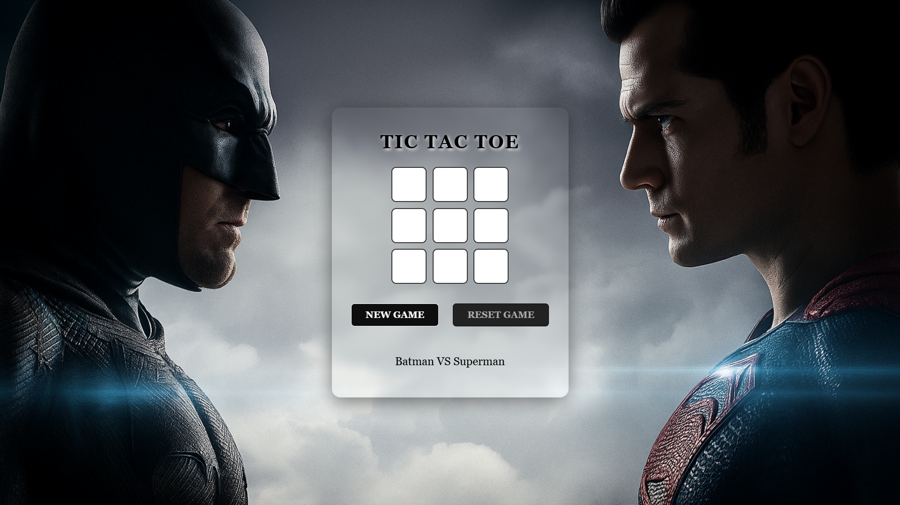

# Tic Tac Toe

A simple, interactive Tic Tac Toe game built with HTML, CSS, and JavaScript.

---

## Features

- Clean, responsive UI
- Two-player gameplay (O vs X)
- "NEW GAME" resets everything instantly
- "RESET GAME" lets you replay after a win/draw
- Win/draw messages update automatically
- Custom images and favicon

## How to Play

1. Players take turns clicking an empty square to place their mark (O or X).
2. First to align three in a row (horizontally, vertically, or diagonally) wins.
3. Click **NEW GAME** to start fresh any time.
4. Click **RESET GAME** after a finished game to play again.

## Project Structure

tic-tac-toe/
├── index.html
├── style.css
├── script.js
├── assets/
│ ├── background.png
│ ├── icon.png
│ └── screenshot.png
└── README.md

## Screenshot

## Live Demo

<!-- Add your link below after enabling GitHub Pages -->
[Play Online](https://your-username.github.io/your-repo-name/)

## Getting Started

1. Clone or download this repository.
2. Open `index.html` in your browser—no setup required.

## License

This project is open for educational and personal use only.

---

_Made with ❤️ for web development practice._
